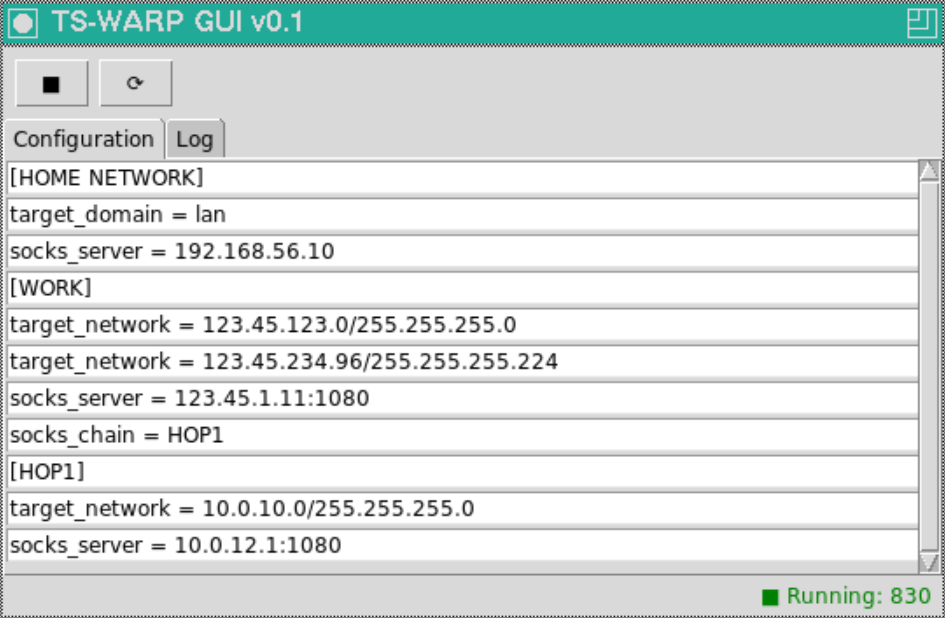

# TS-Warp

## Transparent SOCKS protocol Wrapper

### Goals and TODO list

- [x] Create a soxifier service - transparent firewall-based redirector of
TCP/IP connections to a SOCKS-proxy server

- Support platforms:
  - [x] macOS, FreeBSD with PF, OpenBSD (not tested)
  - [x] Linux with Iptables

- [x] IPv6 stack support
- [x] Maintain simple configuraion structure as INI-file
- [x] Support basic SOCKS authentication methods
- [x] Password encoding (obfuscation) in configuration files
- [x] SOCKS proxy chains
- [x] Daemon mode
- [x] Front-end UI
- [x] Installation script
- [ ] Documentation

### Changelog

See it [here](CHANGELOG.md)

### Installation

- `make install` or `make install PREFIX=/path/to/install`. Default is `PREFIX=/usr/local`

- Create `<PREFIX>/etc/ts-warp.ini` based on `<PREFIX>/etc/ts-warp.ini.sample` file to suite your needs
  
- **On macOS and \*BSD**:
  - Create `<PREFIX>/etc/ts-warp_pf.conf` based on `<PREFIX>/etc/ts-warp_pf.conf.sample` to configure packet filter
  - *Optional*. Edit `<PREFIX>/etc/ts-warp.sh` to customize PID- LOG- and INI- files location

- **On Linux**:
  - Create `<PREFIX>/etc/ts-warp_iptables.sh` based on `<PREFIX>/etc/ts-warp_iptables.sh.sample` to configure firewall

### Usage

**On macOS and \*BSD**:

Under root privileges start, control or get status of ts-warp:

`# <PREFIX>/etc/ts-warp.sh start|stop|restart|reload|status`

**On Linux**:

Using root privileges:

- Enable packet redirection: `# <PREFIX>/etc/ts-warp_iptables.sh`
- Start ts-warp daemon: `# <PREFIX>/bin/ts-warp -d`

ts-warp understands `SIGHUP` signal as command to reload configuration and `SIGINT` to stop the daemon.

Use `ts-pass` to encode passwords if requred. See examples in [ts-warp.ini](examples/ts-warp.ini)

### GUI front-end

Experimental GUI front-end application to control ts-warp daemon can be installed from the `gui` directory:

`make install` or `make install PREFIX=/path/to/install`. Default is `PREFIX=/usr/local`

To start the GUI run:
`# /<PREFIX>/bin/gui-warp.py`

Note, Python 3 interpreter is required for the GUI

### Contacts

Not so early stage of development, yet don't expect everything to work properly.
If you have found a problem, idea or a question, do not hesitate to open an
[issue](https://github.com/mezantrop/ts-warp/issues/new/choose) or write me
directly: Mikhail Zakharov <zmey20000@yahoo.com>

Many thanks to [contributors](CONTRIBUTORS.md) of the project
