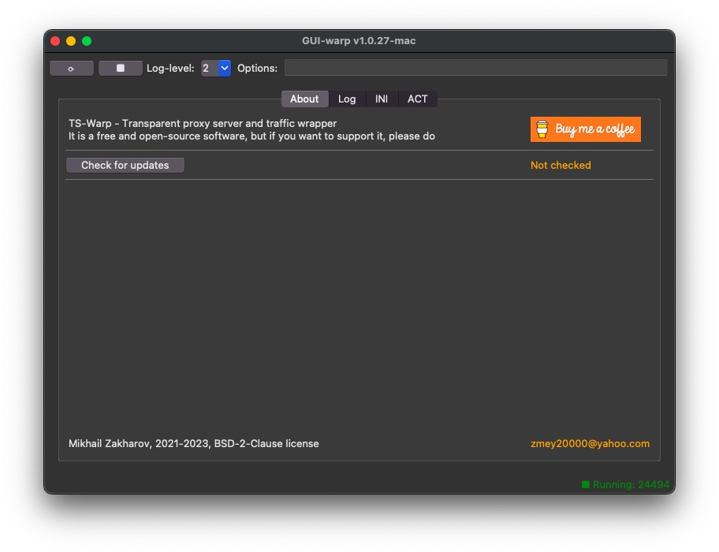

# TS-Warp

[](https://github.com/mezantrop/ts-warp/actions/workflows/codeql.yml)
[](https://github.com/mezantrop/ts-warp/actions/workflows/c-cpp-macos.yml)
[](https://github.com/mezantrop/ts-warp/actions/workflows/c-cpp-ubuntu.yml)

## Transparent proxy server and traffic wrapper

<a href="https://www.buymeacoffee.com/mezantrop" target="_blank"></a>

### Features

- Proxy services with TCP-traffic redirection to external Socks4/5, HTTPS and SSH2* proxy servers
  - Transparent firewall-based traffic redirector
  - Internal Socks and HTTPS proxy server

  \* Requires [libssh2](https://libssh2.org) library

- Supported platforms:

  | OS           | PF                   | ip/nftables          |
  |--------------|----------------------|----------------------|
  | macOS        | :white_check_mark:   | :white_large_square: |
  | FreeBSD      | :white_check_mark:   | :white_large_square: |
  | OpenBSD      | :white_check_mark:   | :white_large_square: |
  | Linux        | :white_large_square: | :white_check_mark:   |
  | Windows WSL2 | :white_large_square: | :white_check_mark:   |

- Main features
  | Transparent proxy                      | Socks5             | Socks4               | HTTPS              | SSH2                  |
  |----------------------------------------|--------------------|----------------------|--------------------|-----------------------|
  | Proxy protocol                         | :white_check_mark: | :white_check_mark:   | :white_check_mark: | :white_check_mark:    |
  | Proxy chains                           | :white_check_mark: | :white_check_mark:   | :white_check_mark: | :white_large_square:* |
  | Proxy workload balancer                | :white_check_mark: | :white_check_mark:   | :white_check_mark: | :white_check_mark:    |
  | Authentication                         | :white_check_mark: | :white_large_square: | :white_check_mark: | :white_check_mark:    |
  | IPv6 stack support                     | :white_check_mark: | :white_large_square: | :white_check_mark: | :white_check_mark:    |
  | Remote names resolution: [NS-Warp](ns) | :white_check_mark: | :white_large_square: | :white_check_mark: | :white_check_mark:    |

  \* Only one SSH2 proxy server allowed per chain

  | Internal proxy                         | Socks5               | HTTPS                |
  |----------------------------------------|----------------------|----------------------|
  | Proxy protocol                         | :white_check_mark:   | :white_check_mark:   |
  | Proxy chains                           | :white_check_mark:   | :white_check_mark:   |
  | Proxy workload balancer                | :white_check_mark:   | :white_check_mark:   |
  | Authentication                         | :white_large_square: | :white_large_square: |
  | IPv6 stack support                     | :white_check_mark:   | :white_check_mark:   |
  | Remote names resolution                | :white_check_mark:   | :white_check_mark:   |

- Miscellaneous features
  - [x] Simple configuration structure as INI-like file
  - [x] Password encoding (obfuscation) in configuration files
  - [x] Daemon mode
  - [x] Front-end UI
  - [x] Installation script (via Makefile)

- TODO
  - [ ] UDP support
  - [ ] Internal Socks4 proxy support
  - [ ] Socks4a protocol support
  - [ ] OS specific `select` alternatives: `epol` / `kqueue`
  - [ ] Faster NS-Warp
  - [ ] Documentation

### Changelog

**Attention! To incorporate HTTP proxy service, `socks_*` variables in `ts-warp.ini` are replaced by `proxy_*` ones.
The deprecated variables will be eventually removed in the further releases**

See it [here](CHANGELOG.md)

### Quick Installation

```sh
# If SSH2 proxy support is required, install https://libssh2.org library first, then download ts-warp:

git clone https://github.com/mezantrop/ts-warp && cd ts-warp

# `configure` script understands a number of environmental variables. You can force setting custom values to:
# `PREFIX`, `LIBSSH2` `WITH_TCP_NODELAY`, `WITH_LIBSSH2`, `USER`, otherwise they will be auto-detected.

./configure && make && sudo make install clean

# Copy and edit configuration files
sudo cp /usr/local/etc/ts-warp.ini.sample /usr/local/etc/ts-warp.ini && sudo vi /usr/local/etc/ts-warp.ini

# on *BSD and macOS
sudo cp /usr/local/etc/ts-warp_pf.conf.sample /usr/local/etc/ts-warp_pf.conf
sudo vi /usr/local/etc/ts-warp_pf.conf

# on Linux with nftables
sudo cp /usr/local/etc/ts-warp_nftables.sh.sample /usr/local/etc/ts-warp_nftables.sh
sudo vi /usr/local/etc/ts-warp_nftables.sh

# on Linux with iptables
sudo cp /usr/local/etc/ts-warp_iptables.sh.sample /usr/local/etc/ts-warp_iptables.sh
sudo vi /usr/local/etc/ts-warp_iptables.sh

# on Windows WSL2 (Ubuntu) with iptables
wsl --set-default-version 2

Packages required for CLI: gcc, make. For GUI-Warp: python3-tk

sudo cp /usr/local/etc/ts-warp_iptables.sh.sample /usr/local/etc/ts-warp_iptables.sh
sudo vi /usr/local/etc/ts-warp_iptables.sh
```

### Usage

You can control, e.g. start, stop `ts-warp` daemon using `ts-warp.sh` script. Under root privileges or `sudo` run:

```sh
# <PREFIX>/etc/ts-warp.sh start|stop|reload|restart [options]
# <PREFIX>/etc/ts-warp.sh status
```

For example:

```sh
sudo /usr/local/etc/ts-warp.sh start
sudo /usr/local/etc/ts-warp.sh stop
```

After succesfull start, TS-Warp transparently redirects traffic according to the configuration specified in
`ts-warp.ini` and firewall rules. Also, TS-Warp spawns Socks5 proxy server at `localhost:10800` and HTTPS proxy
(CONNECT method) at `localhost:8080`.

### Low-level ts-warp daemon usage

All the ts-warp command-line options can be listed using `$ ts-warp -h`:

```sh
Usage:
  ts-warp -T IP:Port -S IP:Port -H IP:Port -c file.ini -l file.log -v 0-4 -t file.act -d -p file.pid -f -u user -h

Version:
  TS-Warp-X.Y.Z

All parameters are optional:
  -T IP:Port      Local IP address and port for incoming Transparent requests
  -S IP:Port      Local IP address and port for internal Socks server
  -H IP:Port      Local IP address and port for internal HTTP server

  -l file.log     Main log filename
  -v 0..4         Log verbosity level: 0 - off, default: 3
  -t file.act     Active connections and traffic log

  -d              Daemon mode
  -p file.pid     PID filename
  -f              Force start

  -u user         A user to run ts-warp, default: nobody

  -h              This message
```

 `ts-warp.sh` respects `ts-warp` daemon options. For example, to temporary enable more verbose logs, restart `ts-warp`
 with `-v 4` option:

```sh
sudo /usr/local/etc/ts-warp.sh restart -v 4
```

`ts-warp` understands several signals:

- `SIGHUP` signal as the command to reload configuration
- `SIGUSR1` to display current configuration state. Note, load balancer can dynamically reorder configuration sections
- `SIGUSR2` to show active clients connection status and traffic stats
- `SIGINT` to stop the daemon.

Use `ts-pass` to encode passwords if requred. See examples in [ts-warp.ini](examples/ts-warp.ini)

### GUI front-end



The GUI front-end application to control `ts-warp` daemon can be installed from the `gui` directory:

```sh
cd gui
sudo make install
```

*Optionally*. Set `PREFIX`, to use a different installation target in the `make` command above:

``` sh
sudo make install PREFIX=/path/to/install
```

To start the GUI run:

``` sh
sudo -b <PREFIX>/bin/gui-warp.py
```

Note, Python 3 interpreter with `tkinter` support is required to run the GUI frontend.

### macOS All-in-one TS-Warp + GUI-Warp App

Check [releases](https://github.com/mezantrop/ts-warp/releases) and download macOS standalone precompiled application.
Read related [README.md](gui/ports/macOS/README.md) for information and instructions.

### Contacts

Not so early stage of development, yet don't expect everything to work properly. If you have an idea, a question,
or have found a problem, do not hesitate to open an [issue](https://github.com/mezantrop/ts-warp/issues/new/choose)
or mail me: Mikhail Zakharov <zmey20000@yahoo.com>

Many thanks to [contributors](CONTRIBUTORS.md) of the project
